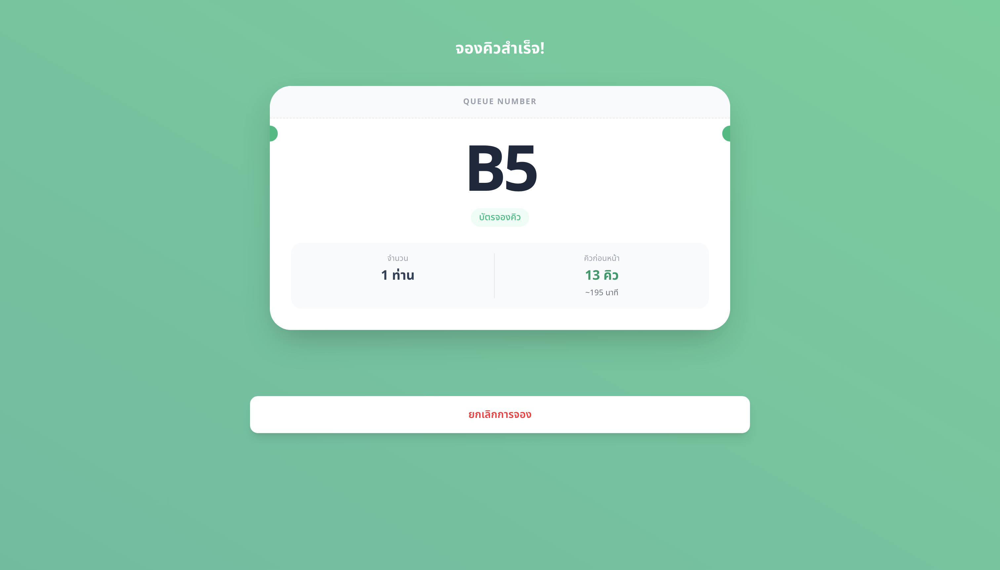

# Table Reservation System (Queue Management)

A simple, lightweight queue reservation system designed for small to medium-sized restaurants. This project serves as an educational sandbox to explore and implement a full-stack architecture using **Golang**, **MongoDB**, and **Next.js**.

> **Note:** The application interface is currently in Thai (TH).

## 🚀 Live Demo

Check out the deployed frontend on Vercel:
**[https://table-reservation-two.vercel.app/](https://table-reservation-two.vercel.app/)**

## 📚 About The Project

This repository is primarily a learning resource demonstrating how to build a scalable backend with Go and connect it to a modern React-based frontend.

**Key Learning Goals:**
- Building RESTful APIs with **Go (Golang)**.
- Managing data persistence with **MongoDB**.
- Creating a responsive user interface with **Next.js**.
- Handling real-time queue logic and status updates.

## 🛠 Tech Stack

### Frontend
- **Framework:** [Next.js](https://nextjs.org/)
- **Language:** JavaScript/TypeScript
- **Styling:** Tailwind CSS
- **Deployment:** Vercel

### Backend
- **Language:** [Go (Golang)](https://go.dev/)
- **Database:** [MongoDB](https://www.mongodb.com/)
- **Driver:** mongo-driver
- **Deployment:** Railway

## 📸 Screenshots

| Booking Interface | Queue Status |
|:---:|:---:|
|  |  |
| *User selects number of guests* | *User receives queue number & wait time* |

## ✨ Features (Current)

- **Queue Status Dashboard:** View the current number of waiting queues in real-time.
- **Reservation System:** Simple interface for customers to book a queue based on the number of seats.
- **Ticket Generation:** Generates a queue ticket (e.g., B5) with estimated waiting time.
- **Cancellation:** Users can cancel their reservation if needed.

## 🚧 Roadmap

- [ ] Add Admin Dashboard for restaurant staff.

- [ ] Implement WebSocket for real-time queue updates without refresh.

- [ ] Add user authentication (Line LIFF or Phone number).

- [ ] Multi-language support (EN/TH).

## 🤝 Contributing

Contributions, issues, and feature requests are welcome! Feel free to check the issues page.

Developed by autosuwan
